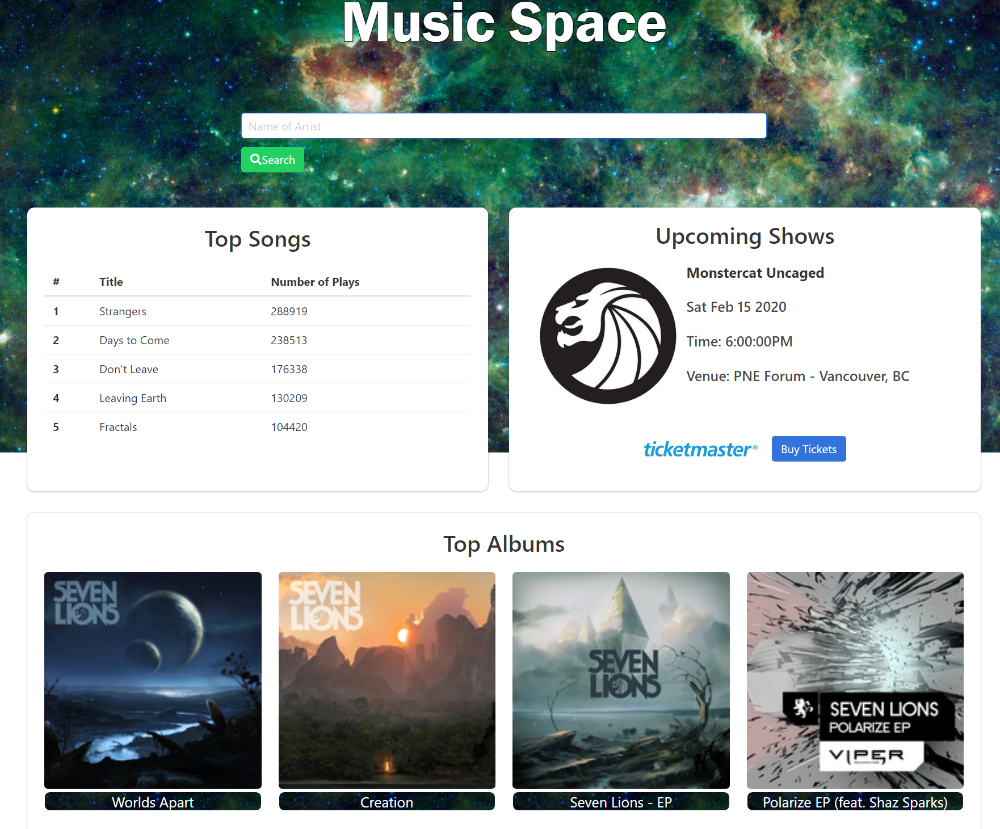

# Music-Space

In this music space, the user is able to search for the latest songs, albums, and upcoming shows from their favorite artists. If interested, the user is a one-click away from being redirected to Ticketmaster to purchase tickets for any upcoming events.

## Technologies Used
* HTML, CSS, REST API, AJAX, Javascript, jQuery, Bulma (Framework)
* APIs from Ticketmaster and last.fm

## Links
The app is deployed on GitHub Pages.
* https://jamieluong03.github.io/Music-Space/

## Collaborators
* Marisa Mark
* Bryan Ballare
